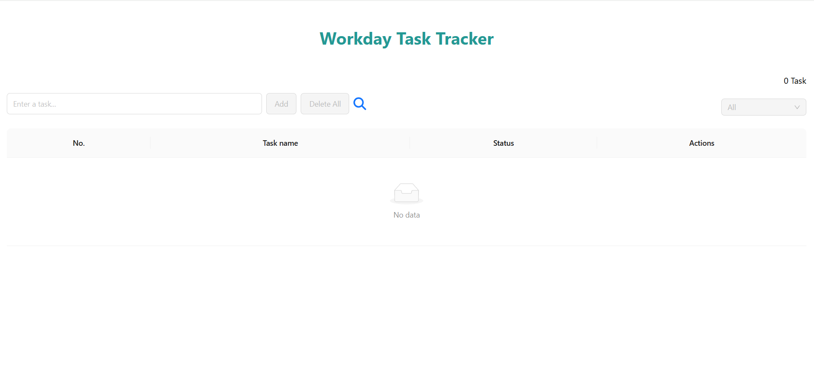

# ✅ React To-Do List Web App

A simple and minimal To-Do List web application built with **ReactJS**. This app allows users to manage their daily tasks by adding, completing, and removing to-dos. Data is stored in the browser using `localStorage`, so tasks remain even after refreshing the page.

## 📸 User Interface Preview

Below is the current UI of the To-Do List App:



## 🚀 Features

- Add new tasks
- Mark tasks as completed
- Delete tasks
- Persist data using `localStorage`
- Optional: Edit tasks, filter by status (Completed / Active)

---

## 📦 Getting Started

Follow the steps below to set up and run the project locally.

### 1. Clone the Repository

```bash
git clone https://github.com/your-username/todo-list.git
cd todo-list
```

### 2. Install Dependencies

Make sure you have **Node.js (v16 or later)** and **npm** or **yarn** installed.

```bash
npm install
```

**Or**

```bash
yarn install
```

### 3. Run the App

Start the server:

```bash
npm start
```

**Or**

```bash
yarn start
```

The app will be available at:

```
http://localhost:3000
```

---

## 🙌 Contributing

Pull requests are welcome. For major changes, please open an issue first to discuss what you'd like to change.

---

## 📬 Contact

For any questions or suggestions, feel free to contact:

**Thanh Tran**
[GitHub](https://github.com/ThanhTran2107)
